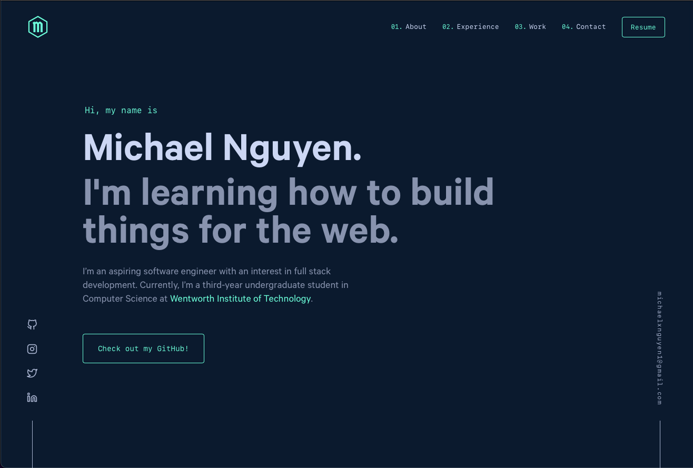

<div align="center">
  
</div>
<h1 align="center">
  michaelnguyen.com - V1
</h1>
<p align="center">
  The first version of <a href="https://michaelnguyen.com"
  target="_blank">michaelnguyen.com</a> built with <a href="https://www.gatsbyjs.org/" target="_blank">Gatsby</a>
</p>
<p align="center">
  Please be advised that this website is <span style="font-weight:bold; color:red;">not</span> yet hosted
</p>



## 🛠 Installation & Set Up

1. Install the Gatsby CLI

   ```sh
   npm install -g gatsby-cli
   ```

2. Install and use the correct version of Node using [NVM](https://github.com/nvm-sh/nvm)

   ```sh
   nvm install
   ```

3. Install dependencies

   ```sh
   yarn
   ```

4. Start the development server

   ```sh
   npm start
   ```

## 🚀 Building and Running for Production

1. Generate a full static production build

   ```sh
   npm run build
   ```

1. Preview the site as it will appear once deployed

   ```sh
   npm run serve
   ```

## ❗ Important Links

&nbsp;&nbsp;&nbsp;&nbsp; &rarr; [Free Favicon Maker](https://formito.com/tools/favicon)

&nbsp;&nbsp;&nbsp;&nbsp; &rarr; [Remove Background](https://www.remove.bg)

&nbsp;&nbsp;&nbsp;&nbsp; &rarr; [Method Draw Vector Editor](https://editor.method.ac)

&nbsp;&nbsp;&nbsp;&nbsp; &rarr; [SVG Path Visualizer](https://svg-path-visualizer.netlify.app/#M140%2020C73%2020%2020%2074%2020%20140c0%20135%20136%20170%20228%20303%2088-132%20229-173%20229-303%200-66-54-120-120-120-48%200-90%2028-109%2069-19-41-60-69-108-69z)

&nbsp;&nbsp;&nbsp;&nbsp; &rarr; [SVG Path Editor](https://svg-path-visualizer.netlify.app/#M140%2020C73%2020%2020%2074%2020%20140c0%20135%20136%20170%20228%20303%2088-132%20229-173%20229-303%200-66-54-120-120-120-48%200-90%2028-109%2069-19-41-60-69-108-69z)

## ✏️ Notes

&nbsp;&nbsp;&nbsp;&nbsp; Font for logo: Germania One (Google Font)

## 🎨 Color Reference

| Color          | Hex                                                                |
| -------------- | ------------------------------------------------------------------ |
| Navy           |  `#0a192f` |
| Light Navy     |  `#112240` |
| Lightest Navy  |  `#233554` |
| Slate          |  `#8892b0` |
| Light Slate    |  `#a8b2d1` |
| Lightest Slate |  `#ccd6f6` |
| White          |  `#e6f1ff` |
| Green          |  `#64ffda` |
